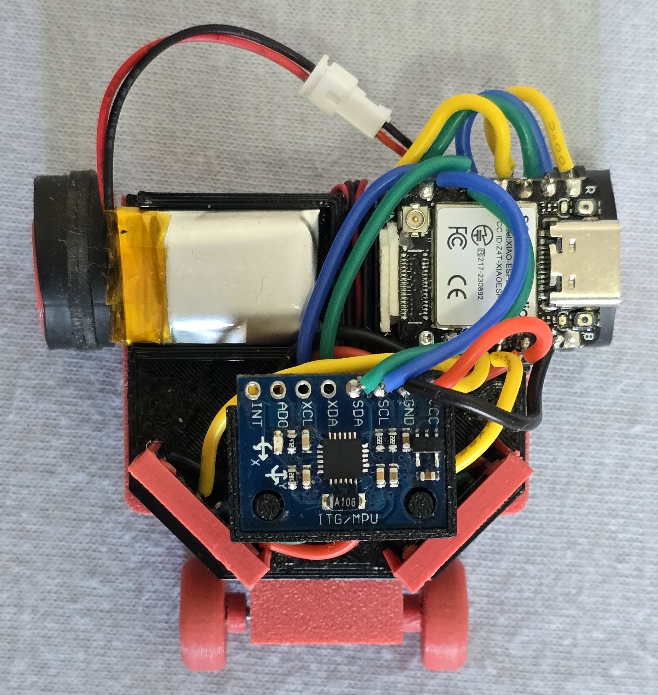
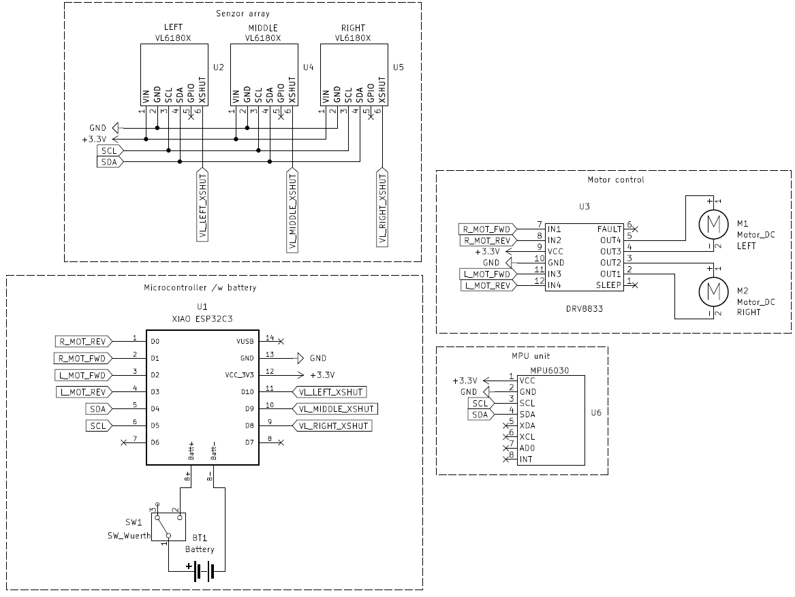

# Self-Driving RC Car — Edge Inference Controller

[](https://platformio.org/)
[](https://www.arduino.cc/)
[](https://www.espressif.com/en/products/socs/esp32-s3)
[](https://isocpp.org/)

> 🔗 **Sister Repository**
> *This repository handles hardware deployment and edge inference. The simulation environment, reward shaping, and model training algorithms live in the [rc-drive-sim](https://github.com/Lionile/rc-drive-sim) repository.*


## Overview: Bridging the Sim-to-Real Gap

This project deploys a Reinforcement Learning (RL) policy, trained entirely in a simulated environment, onto a physical RC car. The microcontroller runs a neural network inference loop at 50 Hz, processing real-time sensor data to output motor commands.

The goal is to translate idealized simulation physics into robust hardware control that can handle sensor noise, physical latency, and real-world dynamics.

**The Deployment Pipeline:**
1. Train the model in simulation (`rc-drive-sim`).
2. Export the trained weights and biases as a C++ header (`model_structure.h`).
3. Flash the firmware to the ESP32-S3.
4. The car drives autonomously.

---

## Hardware Architecture

The physical car is built around a Seeed XIAO ESP32S3, chosen for its small form factor and sufficient compute power for edge AI.



### Bill of Materials (BOM)

| Component | Role | Details |
| :--- | :--- | :--- |
| **Seeed XIAO ESP32S3** | Main Controller | Runs the 50 Hz inference loop and motor PWM. |
| **DRV8833** | Motor Driver | Dual H-bridge driving the DC motors at 20 kHz. |
| **3x VL6180X** | Distance Sensors | Time-of-Flight (ToF) sensors for obstacle detection (Left, Center, Right). |
| **MPU6050** | IMU | Provides gyroscope data for yaw integration (±2000 dps). |
| **Seeed XIAO ESP32C6** | Telemetry Node | (Optional) Receives ESP-NOW telemetry for real-time monitoring. |

### Wiring & Pinout



* **Motor Control (DRV8833):**
  * Left Motor: `FWD = D3`, `REV = D4`
  * Right Motor: `FWD = D2`, `REV = D1`
* **Sensors (I2C):**
  * Shared I2C bus at 400 kHz.
  * VL6180X XSHUT pins: `Left = D10`, `Center = D9`, `Right = D8`.
  * *Note: The VL6180X sensors share a default I2C address. The firmware uses the XSHUT pins to boot them sequentially and reassign their addresses (0x2A, 0x2B, 0x2C) at startup.*

---

## Edge Inference Loop

The main application (`src/main.cpp`) runs a non-blocking control loop.

1. **Sensor Polling:** The three VL6180X sensors are configured for fast continuous ranging. The `loop()` checks for ready data and normalizes readings to a `[0, 1]` range (representing 10mm to 180mm).
2. **IMU Integration:** The MPU6050 is burst-read to update the current yaw angle. Gyro bias is calibrated automatically on boot.
3. **State Vector Construction:** The system builds a 27-dimensional input vector. This includes the 3 current sensor readings plus a history buffer of 24 past readings (8 past states × 3 sensors, with a configurable stride), providing the network with temporal context.
4. **Neural Network Inference:** The custom C++ neural network class (`src/neural_network.h`) performs a forward pass using the weights defined in `model_structure.h`.
5. **Motor Actuation:** The network outputs are scaled and converted to 20 kHz MCPWM signals. A configurable `TURN_GAIN` allows fine-tuning of the steering authority without retraining the model.
6. **Telemetry:** Every 5 ticks, a batched telemetry packet (sensors, IMU, and motor commands) is broadcast via ESP-NOW to a monitoring station.

---

## Performance Profiling

Running a neural network on a microcontroller requires strict timing. Execution latency was profiled using the `scripts/analyze_logs.py` tool on a live run.

With a target frequency of 50 Hz, there is a **20,000 µs** budget per control tick.

| Operation | Avg Latency | Std Dev | Min | Max |
| :--- | :--- | :--- | :--- | :--- |
| **NN Inference + Action** | **3,730 µs** | 27.4 µs | 3,708 µs | 3,840 µs |
| ESP-NOW Transmit (Batched) | 3,181 µs | 18.2 µs | 3,144 µs | 3,203 µs |
| VL6180X Read (Left) | 350 µs | 9.5 µs | 343 µs | 403 µs |
| VL6180X Read (Center) | 349 µs | 7.2 µs | 343 µs | 388 µs |
| VL6180X Read (Right) | 349 µs | 6.9 µs | 343 µs | 417 µs |

**Conclusion:** The neural network inference itself consumes only ~18.6% (3,730 µs) of the total budget. Even when summing the network execution, ESP-NOW transmission, and all sensor reads, the total execution time sits around 7,960 µs (~39.8% of the budget). This leaves massive overhead room to ensure a highly stable 50 Hz control loop without dropping ticks.

---

## Build & Flash (PlatformIO)

This project uses PlatformIO and defines multiple environments in `platformio.ini` for the main application and various testing harnesses.

### 1. Install Dependencies
Ensure you have [VS Code](https://code.visualstudio.com/) with the [PlatformIO extension](https://platformio.org/install/ide?install=vscode) installed.

### 2. Update the Model (Optional)
If you have trained a new model in `rc-drive-sim`, run the export script in that repository to generate a new `model_structure.h` file, and replace the one in `include/model_structure.h`.

### 3. Build and Upload
Open the PlatformIO terminal and run the appropriate environment:

**Main Autonomous Controller (ESP32-S3):**
```bash
pio run -e seeed_xiao_esp32s3_rl -t upload
```

**Telemetry Receiver (ESP32-C6):**
*(Flash this to a second MCU connected to your PC to view live data)*
```bash
pio run -e seeed_xiao_esp32c6_telemetry -t upload
```

---

## Testing & Calibration Tools

The `scripts/` directory contains Python tools for hardware validation and telemetry monitoring:

* **`robot_control.py`**: A Tkinter GUI dashboard. Connects to the telemetry receiver to display a live compass, sensor bars, and raw IMU data. It also allows sending manual motor commands.
* **`rotation_test_automation.py`**: Automates hardware calibration by sending specific motor commands and recording the resulting yaw rotation to a CSV file.
* **`analyze_rotation_results.py`**: Performs linear regression on the rotation test data to validate motor linearity and gyro accuracy.
* **`analyze_logs.py`**: Parses the serial output to generate the microsecond latency statistics shown in the profiling section.